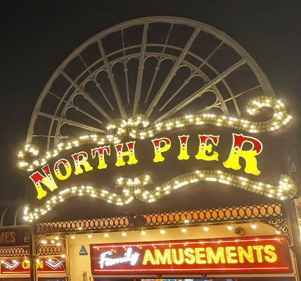
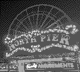
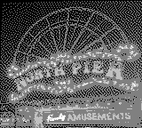
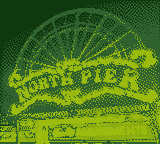
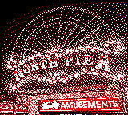

# Gameboy Camera Lib

## Overview
A Java library capable of encoding, decoding, injecting and extracting Gameboy Camera 2BPP images as PNGs or BufferedImages into or from existing Gameboy Camera save files.

## Examples

### Original Photo to Encode
 

### Gameboy Encoded (then decoded for web use) Photo Using Various Gameboy Palettes
   

## Installation
Note rhis project still has a few unimplemented features, however since it's been a few years in dev, and it's already in use by third party software, a Maven artifact is now available.

Add the following to your Maven project pom.xml:
```xml
<dependency>
    <groupId>uk.co.silentsoftware</groupId>
    <artifactId>gameboy-camera-lib</artifactId>
    <version>1.2.0</version>
</dependency>
```

## Usage

### Choose a palette
Gameboy images contain no RGB palette information, only 4 shades. The representation of these shades
on a true colour display requires you to make a choice as to what RGB values they represent, usually greens 
(screen like) or greys (printer like). 

A few example palettes are already available in the "uk.co.silentsoftware.codec.IndexPalette" class.
From the "uk.co.silentsoftware.codec.IndexPalette" class decide which palette constant you want to
use to decode/encode images or define your own indexed array pass it into the constructor on this class.
Inject the IndexedPalette into the constructor for the decoder or encoder classes described below.

### To decode

Either...

#### Extract from an existing camera dump file

If you have a Gameboy Camera save dump call any of the public "extract" or "extractAsPng" methods in:
"uk.co.silentsoftware.codec.extractor.SaveImageExtractor" using the "Extractor" interface.

E.g.
```java
Extractor extractor = new SaveImageExtractor(new IndexedPalette(IndexedPalette.EVEN_DIST_PALETTE));
List<BufferedImage> images = extractor.extract(new File("C:/Temp/MyGameboyImageSaveFile.sav"));
```
Alternatively
```java
Extractor extractor = new SaveImageExtractor(new IndexedPalette(IndexedPalette.EVEN_DIST_PALETTE));
List<byte[]> pngImages = extractor.extractAsPng(new File("C:/Temp/MyGameboyImageSaveFile.sav"));
```

#### Decode Gameboy compatible 2bpp byte data only

If you have extracted a single image as a 2bpp byte data array already simply call the public "decode" method in:
"uk.co.silentsoftware.codec.image.ImageCodec" using the "Codec" interface.

E.g.
```java
Codec codec = new ImageCodec(new IndexedPalette(IndexedPalette.GAMEBOY_LCD_PALETTE), SaveImageConstants.IMAGE_WIDTH, SaveImageConstants.IMAGE_HEIGHT)
BufferedImage myBufferedImage = codec.decode(myRaw2BppImageDataArray);
```

### To encode

Either...

#### Inject into an existing camera dump file

If you have a Gameboy Camera save dump call any of the public "inject" methods in: "uk.co.silentsoftware.codec.injector.SaveImageInjector" using the "Injector" interface
and this will overwrite the images in your save. 

Note the following caveats
- The save dump must have the images already populated that you'd like to replace, i.e. it can't add images to the save, just replace existing images. This is due to an incomplete reverse engineered specification for the camera dump file format.
- There is a maximum (hardware) limit of 30 images. If you attempt to inject more than this they will be silently dropped.

E.g.
```java
List<File> filesToInject = new ArrayList<>();
filesToInject.add("C:/Temp/NewImageToInject1.jpg"); // First photo
filesToInject.add("C:/Temp/NewImageToInject2.jpg"); // Second photo (etc).
Injector injector = new SaveImageInjector();
byte[] myUpdatedImageFile = injector.inject(new File("C:/Temp/MyGameboyImageSaveFile.sav"), filesToInject);
```
Alternatively
```java
List<BufferedImage> imagesToInject = ...
byte[] saveFileByteData = ...
Injector injector = new SaveImageInjector();
byte[] myUpdatedSaveFileByteData = injector.inject(saveFileByteData, imagesToInject);
```

#### Encode Gameboy compatible 2bpp byte data only

With a BufferedImage call any of the public "encode" methods in
"uk.co.silentsoftware.codec.image.ImageCodec" using the "Codec" interface.

E.g.
```java
Codec codec = new ImageCodec(new IndexedPalette(IndexedPalette.GAMEBOY_LCD_PALETTE), SaveImageConstants.IMAGE_WIDTH, SaveImageConstants.IMAGE_HEIGHT)
byte[] myRaw2BppImageDataArray = codec.encode(myBufferedImageData);
```

The source BufferedImage data will be dithered and converted to the specified dimensions compatible with Gameboy hardware. 
If you want to customise this then consider using the "encodeNoPreprocessing" method, but you will need your images to use IndexedPalette and width/height you 
specified in the ImageCodec constructor (constants are available in SaveImageConstants.java of 160x144 for printer saves 
or 128x112 for camera dumps).

### Still To Do and Work In Progress

- Gameboy Printer byte data image injection (suitable for use with real printer hardware). Currently in progress.
- Gameboy Printer byte data image extraction (suitable for debugging raw stream data from a printer).
- More tests and better error handling (code has all been tested manually with uncommitted local integration tests but YMMV).
- Command line interface to support third party APIs/other languages.
